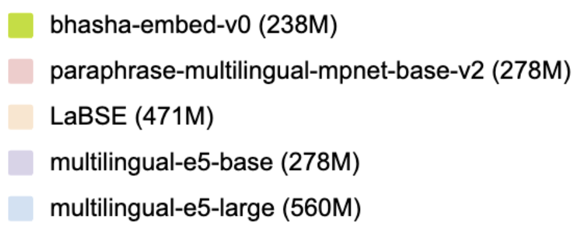

## <font color="#488AC7"> Bhasha embed v0 model  </font>

This is an embedding model that can embed texts in Hindi (Devanagari script), English and  Romanized Hindi. 
There are many multilingual embedding models which work well for Hindi and English texts individually, but lack the following capabilities.  

1. **Romanized Hindi support**: This is the first embedding model to support Romanized Hindi (transliterated Hindi / hin_Latn).
2. **Cross-lingual alignment**: This model outputs language-agnostic embedding. This enables querying a multilingual candidate pool containing a mix of Hindi, English and Romanised Hindi texts.

<br>

## <font color="#488AC7"> Model Details </font>
- **Supported Languages:** Hindi, English, Romanised Hindi
- **Base model:** [google/muril-base-cased](https://huggingface.co/google/muril-base-cased)
- **Training GPUs:** 1xRTX4090
- **Training methodology:** Distillation from English embedding model and Fine-tuning on triplet data.
- **Maximum Sequence Length:** 512 tokens
- **Output Dimensionality:** 768 tokens
- **Similarity Function:** Cosine Similarity


### Model Sources

- **Hugging Face:** [link](https://huggingface.co/AkshitaS/bhasha-embed-v0)
- **Developer:** [Akshita Sukhlecha](https://www.linkedin.com/in/akshita-sukhlecha/)

<br>

## <font color="#488AC7"> Results </font>



<b>Results for English-Hindi cross-lingual alignment</b> : Tasks with corpus containing texts in Hindi as well as English 


<b>Results for Romanised Hindi tasks</b> : Tasks with texts in Romanised Hindi  


<b>Results for retrieval tasks with multilingual corpus</b> : Retrieval task with corpus containing texts in Hindi, English as well as Romanised Hindi  


<b>Results for Hindi tasks</b> : Tasks with texts in Hindi (Devanagari script)  


### Additional information
- Some task dataset links: [Belebele](https://huggingface.co/datasets/facebook/belebele), [MLQA](https://huggingface.co/datasets/facebook/mlqa), [XQuAD](https://huggingface.co/datasets/google/xquad), [SemRel24](https://huggingface.co/datasets/SemRel/SemRel2024)
- hin_Latn tasks: Most hin_Latn tasks have been created by transliterating hindi texts using [indic-trans library](https://github.com/libindic/indic-trans)
- Detailed results: [github_link](/eval/results/eval_results.csv)

<br>

## <font color="#488AC7"> Sample outputs </font>

### Example 1


### Example 2


### Example 3


### Example 4 


<br>

## <font color="#488AC7"> Scripts </font>

### Replicate results 
1. `cd eval`
2. `pip install -r requirements.txt`
3. `python evaluator.py`

### Run examples 
Run few examples depicting model's capabilities : 
1. `pip install sentence-transformers numpy`
2. `python examples.py`

### Usage
Script to encode queries and passages and compute similarity scores using Sentence Transformers or 🤗 Transformers.
1. `pip install sentence-transformers numpy`
2. `python usage.py`

<br>

## Citation
To cite this model:
```
@misc{sukhlecha_2024_bhasha_embed_v0,
  author = {Sukhlecha, Akshita},
  title = {Bhasha-embed-v0},
  howpublished = {Hugging Face},
  month = {June},
  year = {2024},
  url = {https://huggingface.co/AkshitaS/bhasha-embed-v0}
}
```